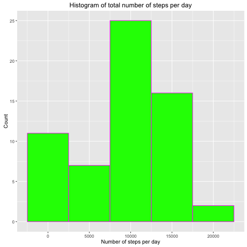
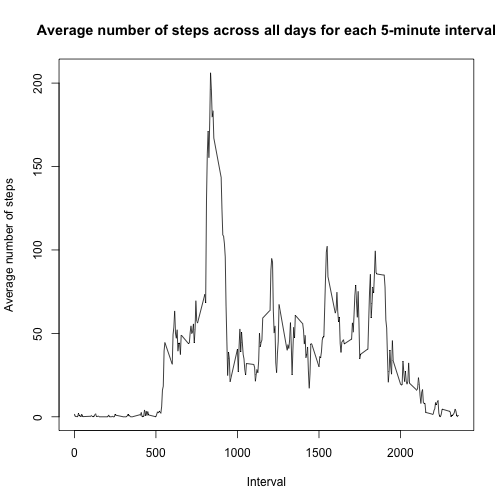
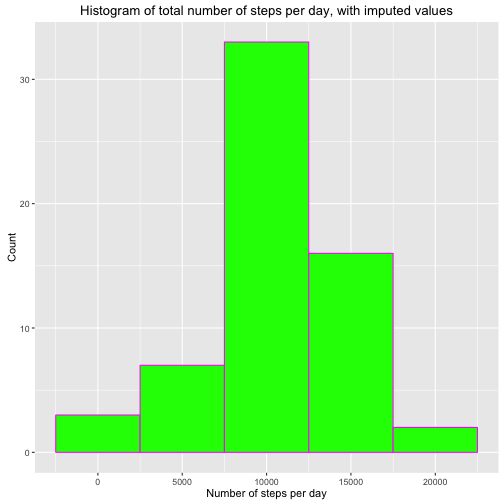
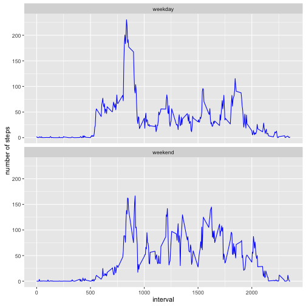

## Loading and preprocessing the data

```r
#assuming that data has been downloaded and placed in working directory

unzip("activity.zip")
activity <- read.csv("activity.csv")
```

## What is mean total number of steps taken per day?

```r
#use tapply to find the sum of steps for each day in the dataset

stepsperday <- with(activity, tapply(steps,date,sum,na.rm = TRUE))

#convert to data frame for use with ggplot
df <- data.frame(stepsperday)

library(ggplot2)
ggplot(df, aes(x = stepsperday)) + 
        geom_histogram(binwidth = 5000, colour = "magenta", fill = "green") + 
        ggtitle("Histogram of total number of steps per day") + 
        xlab("Number of steps per day") + ylab("Count")
```



```r
#calculate mean and median number of steps per day for report
meanSteps <- mean(stepsperday)
medianSteps <- median(stepsperday)
```
The mean total number of steps per day is 9354.
The median total number of steps per day is 10395.

## What is the average daily activity pattern?

```r
#calculate the average daily activity pattern with tapply and plot results
activityPattern <- with(activity, tapply(steps,interval,mean, na.rm = TRUE))
plot(x = names(activityPattern), y = activityPattern, type = "l", 
     xlab = "Interval", ylab = "Average number of steps", 
     main="Average number of steps across all days for each 5-minute interval")
```



```r
#find the interval which on average contains the maximum number of steps
maxInterval <- max(activityPattern)
findNameOfmaxInterval <- activityPattern == maxInterval
maxIntervalName <- names(activityPattern[findNameOfmaxInterval])
```
The 5-minute interval that on average across all days contains the maximum number of steps is 835.

## Imputing missing values

```r
#calculate the total number of missing values in the dataset for reporting
activityNA <- is.na(activity$steps)
totalNA <- sum(activityNA)

#impute value based on the mean for the 5-minute interval across all days
#using the previously calculated variable activityPattern. only impute value if
#value is NA. (use round for the mean since number of steps has to be a whole
#number). NewActivity is the variable where missing values are filled in.
NewActivity <- activity
for (i in 1:17568) {
        if (is.na(NewActivity$steps[i])) {
                interval <- NewActivity[i,3]
                find_mean <- names(activityPattern) == interval
                mean_interval <- activityPattern[find_mean]
                NewActivity$steps[i] <- round(mean_interval)
        }
}
NewActivity$steps <- as.integer(NewActivity$steps)

#calculate total number of steps taken each day when missing values are imputed
#and place them in a data frame to be used in ggplot
stepsperday2 <- with(NewActivity, tapply(steps,date,sum, na.rm = FALSE))
df2 <- data.frame(stepsperday2)

ggplot(df2, aes(x = stepsperday2)) + 
        geom_histogram(binwidth = 5000, colour = "magenta", fill = "green") + 
        ggtitle("Histogram of total number of steps per day, with imputed values") + 
        xlab("Number of steps per day") + ylab("Count")
```



```r
#calculate and report the mean and median total number of steps per day when
#missing values are imputed
meanSteps2 <- mean(stepsperday2)
medianSteps2 <- median(stepsperday2)
```
The total number of missing values in the datasheet is 2304.
The mean total number of steps taken per day after imputing missing values is 10766.
The median total number of steps taken per day after imputing missing values is 10762.

## Are there differences in activity patterns between weekdays and weekends?

```r
#format the date variable and make new variable weekday using the weekdays
#function
NewActivity$date <- as.Date(NewActivity$date, format = "%Y-%m-%d")
NewActivity$weekday <- weekdays(NewActivity$date, abbreviate = FALSE)

#check if the day of week is a weekday or weekend and replace the value with
#either "weekday" or "weekend"
for (i in 1:17568) {
        if (NewActivity$weekday[i] == "Saturday" || 
            NewActivity$weekday[i] == "Sunday") {
                NewActivity$weekday[i] <- "weekend"
        }
        else { NewActivity$weekday[i] <- "weekday"
        }
}
#make the variable weekday into factor, aggregate number of steps by interval
#and weekday and calculate the mean. plot using ggplot and facet_wrap to
#seperate based on weekday/weekend
NewActivity$weekday <- as.factor(NewActivity$weekday)
byWeekdayInterval <- aggregate(steps ~ interval + weekday, NewActivity, mean)
ggplot(byWeekdayInterval, aes(interval,steps)) + geom_line(colour = "blue") + 
        facet_wrap(~weekday, ncol = 1) + ylab("number of steps")
```


